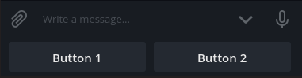
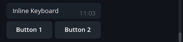
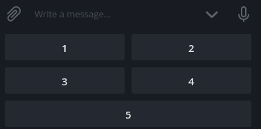
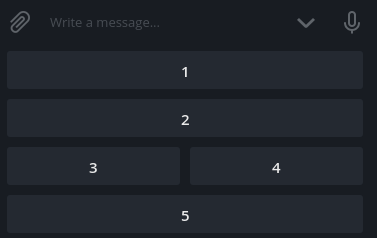
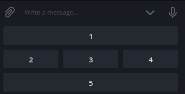
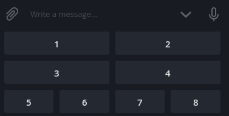

## Keyboard Builder

Simple and powerful reply and inline keyboard builder for Telegram Bots

ref: [telegram-keyboard](https://github.com/RealPeha/telegram-keyboard)

### ID Library

### Legacy

    MqCFEJKSihJf4BBkFi3FfI6ZTb1melOAr

### New

    1CdmLLLtBE1wZ2oxdwYPYMdPIXZLVtdqGEm7k-01JTuAW3Q1-v3DFto-I

## Lumpia

```js
const token = '123456789:abcdefghijklmno'; // <- isikan token botmu disini
const bot = new lumpia.init(token);

const Keyboard = Builder.Keyboard;

function doPost(e) {
  bot.doPost(e);
}

bot.cmd('keyboard', ctx => {
  const keyboard = Keyboard.make([
    ['Button 1', 'Button 2'], // First row
    ['Button 3', 'Button 4'], // Second row
  ])

  ctx.reply('Simple built-in keyboard', keyboard.reply());
  ctx.reply('Simple inline keyboard', keyboard.inline());
});
```


## Reply (build-in) keyboard

#### Example
```javascript
const Keyboard = Builder.Keyboard;

var keyboard = Keyboard.make(['Button 1', 'Button 2']).reply()

// or using shortcut
var keyboard = Keyboard.reply(['Button 1', 'Button 2'])

console.log(keyboard)
```

#### Result
```JSON
{
  "reply_markup": {
    "resize_keyboard": true,
    "keyboard": [
      [
        "Button 1",
        "Button 2"
      ]
    ]
  }
}
```


## Inline keyboard

#### Example
```javascript
const Keyboard = Builder.Keyboard;

const keyboard = Keyboard.make(['Button 1', 'Button 2']).inline()

// or using shortcut
const keyboard = Keyboard.inline(['Button 1', 'Button 2'])

console.log(keyboard)
```

#### Result
```JSON
{
  "reply_markup": {
    "resize_keyboard": true,
    "inline_keyboard": [
      [
        {
          "text": "Button 1",
          "callback_data": "Button 1"
        },
        {
          "text": "Button 2",
          "callback_data": "Button 2"
        }
      ]
    ]
  }
}
```


## Inline keyboard with custom callback data

#### Example
```javascript
const Keyboard = Builder.Keyboard;

const keyboard = Keyboard.make([
  Key.callback('Button 1', 'action1'),
  Key.callback('Button 2', 'action2'),
]).inline()

console.log(keyboard)
```

#### Result
```JSON
{
  "reply_markup": {
    "resize_keyboard": true,
    "inline_keyboard": [
      [
        {
          "text": "Button 1",
          "callback_data": "action1"
        },
        {
          "text": "Button 2",
          "callback_data": "action2"
        }
      ]
    ]
  }
}
```

## Fixed columns keyboard

#### Example
```javascript
const Keyboard = Builder.Keyboard;

const keyboard = Keyboard.make(['1', '2', '3', '4', '5'], {
  columns: 2,
}).reply()

console.log(keyboard)
```

#### Result
```JSON
{
  "reply_markup": {
    "resize_keyboard": true,
    "keyboard": [
      ["1", "2"],
      ["3", "4"],
      ["5"]
    ]
  }
}
```


## Calculated columns keyboard

#### Example
```javascript
const Keyboard = Builder.Keyboard;

const keyboard = Keyboard.make(['1', '2', '3', '4', '5'], {
  wrap: (row, index, button) => Math.random() > 0.5
}).reply()

console.log(keyboard)
```

#### Result
```JSON
{
  "reply_markup": {
    "resize_keyboard": true,
    "keyboard": [ // different every time
      ["1", "2"],
      ["3"],
      ["4"],
      ["5"]
    ]
  }
}
```
 

## Pattern

#### Example

In this example `pattern: [3, 1, 1]` means that the first row will have 3 buttons, the second - 1, the third - 1 and all the other buttons in the last row
```javascript
const Keyboard = Builder.Keyboard;

const keyboard = Keyboard.make([1, 2, 3, 4, 5, 6, 7, 8, 9, 10], {
    pattern: [3, 1, 1]
}).reply()

console.log(keyboard)
```

#### Result
```JSON
{
  "reply_markup": {
    "resize_keyboard": true,
    "keyboard": [
      ["1", "2", "3"],
      ["4"],
      ["5"],
      ["6", "7", "8", "9", "10"]
    ]
  }
}
```

## Custom filter function

Default filter function is `button => !button.hide` but you can pass your filtering function 
#### Example
```javascript
const Keyboard = Builder.Keyboard;

const keyboard = Keyboard.make([1, 2, 3, 4, 5, 6, 7, 8, 9, 10], {
    columns: 2,
    filter: btn => btn % 2
}).reply()

console.log(keyboard)
```

#### Result
```JSON
{
  "reply_markup": {
    "resize_keyboard": true,
    "keyboard": [
      ["1", "3"],
      ["5", "7"],
      ["9"]
    ]
  }
}
```

## Filter after build

#### Example
```javascript
const Keyboard = Builder.Keyboard;

const keyboard = Keyboard.make([1, 2, 3, 4, 5, 6, 7, 8, 9, 10], {
    columns: 2,
    filter: btn => btn % 2,
    filterAfterBuild: true
}).reply()

console.log(keyboard)
```

#### Result
```JSON
{
  "reply_markup": {
    "resize_keyboard": true,
    "keyboard": [
      ["1"],
      ["3"],
      ["5"],
      ["7"],
      ["9"]
    ]
  }
}
```

## Flat buttons

#### Example
```javascript
const Keyboard = Builder.Keyboard;

const keyboard = Keyboard.make([[1, 2], [3, 4, 5, 6], [7, 8, 9, 10]], {
    flat: true,
    columns: 3,
}).reply()

console.log(keyboard)
```

#### Result
```JSON
{
  "reply_markup": {
    "resize_keyboard": true,
    "keyboard": [
      ["1", "2", "3"],
      ["4", "5", "6"],
      ["7", "8", "9"],
      [ "10"]
    ]
  }
}
```

## Combine keyboards

#### Example
```javascript
const Keyboard = Builder.Keyboard;

const keyboard1 = Keyboard.make(['1', '2', '3', '4'], {
  columns: 2
})
const keyboard2 = Keyboard.make(['5', '6', '7', '8'])

const keyboard = Keyboard.combine(keyboard1, keyboard2).reply()

console.log(keyboard)
```

#### Result
```JSON
{
  "reply_markup": {
    "resize_keyboard": true,
    "keyboard": [
      ["1", "2"],
      ["3", "4"],
      ["5", "6", "7", "8"]
    ]
  }
}
```


## More Examples

... to be continue 🤣